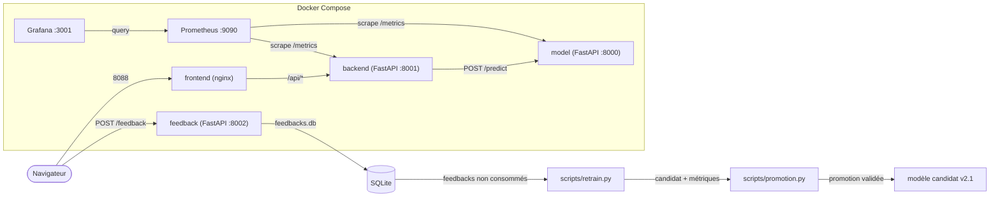

# README Romain

## 🧭 Architecture



    Le flux de réentraînement est séparé de la prédiction : un feedback déclenche
    le job uniquement lorsque le seuil de feedbacks **non consommés** est atteint.
    Le candidat est évalué sur le même `reference_set` que le modèle de production ;
    la promotion reste une décision explicite et les feedbacks sont ensuite marqués
    `used_for_training = 1`.

## 🚀 3 commandes pour démarrer

```bash
# 1. Cloner et se placer dans le repo
git clone https://github.com/joellegermanos-prog/M5-B1-Romain_Joelle.git
cd M5-B1-Romain_Joelle

# 2. Lancer les 3 services + monitoring (build inclus)
docker compose up --build

# 3. Vérifier que tout est sain
docker compose ps
```

Accès une fois lancé : frontend [http://localhost:8088](http://localhost:8088),
backend [http://localhost:8001](http://localhost:8001), model [http://localhost:8000](http://localhost:8000),
feedback [http://localhost:8002](http://localhost:8002).

## Feedback et réentraînement

Le service `feedback` vérifie que le `request_id` existe dans
`data/prod_scored.csv`, puis enregistre l'annotation dans `data/feedbacks.db`.
Un même feedback rejoué est idempotent ; un label différent pour le même dossier
renvoie `409` afin d'imposer un arbitrage humain.

```powershell
# Envoyer une annotation métier
curl.exe -X POST http://localhost:8002/feedback `
    -H "Content-Type: application/json" `
    -d '{\"request_id\":\"REQ-00042\",\"true_label\":1,\"comments\":\"Défaut confirmé\"}'

# Voir le total et le nombre de feedbacks encore disponibles pour l'entraînement
curl.exe http://localhost:8002/feedback/count
```

Le cron vérifie le seuil toutes les six heures :

```text
0 */6 * * * cd /opt/pyrenex && mkdir -p logs && .venv/bin/python scripts/retrain.py --min-feedback 200 >> logs/retrain.log 2>&1
```

Pour exécuter le même traitement manuellement sous PowerShell :

```powershell
New-Item -ItemType Directory -Force logs
.\.venv\Scripts\python.exe .\scripts\retrain.py --min-feedback 200
```

Avec moins de feedbacks que le seuil, le job affiche `Skip` et ne modifie pas
le modèle. Un seuil de `1` permet de tester le parcours complet sur un jeu de
données isolé ; il peut créer un candidat, journaliser la décision et marquer
les lignes consommées.

## Évaluation continue

```powershell
# 1. Construire / vérifier le jeu de référence
python.exe scripts/evaluate_model.py --freeze-baseline

# 2. Evaluations de release standard
python.exe scripts/evaluate_model.py --release-tag v2.0.0

# 3. Test du mode bloquant / dégradation
python.exe scripts/evaluate_model.py --release-tag bad --degrade
```

> La release est bloquée si une métrique passe sous le plancher absolu ou chute de plus que la tolérance `max(2σ, seuil métier)` par rapport au golden run.

## Merge en main

```powershell
git checkout main
git pull --ff-only
git merge romain
```

> Le merge vers `main` ne doit être fait que si les tests et l’évaluation continue sont verts.

## Tag

```powershell
git tag -a v2.0.0 -m "Release v2.0.0"
git push origin main --tags
```

> Le tag sert de repère de release et est utilisé par le workflow GitHub Actions dans le job `evaluate-model` et le push GHCR.

## 🧪 Commandes utiles de validation et d’évaluation

### Tests API / contrat du modèle

```powershell
# tests du service model
python.exe -m pytest -q services/model/tests

# tests du garde-fou d’évaluation continue
python.exe -m pytest -q tests/test_evaluation.py

# test E2E : feedback -> seuil -> réentraînement -> promotion
python -m pytest -q -s tests/test_retrain.py -k feedback_to_retrain_e2e

# tous les tests du flux de réentraînement
python -m pytest -q -s tests/test_retrain.py
```

Le test `feedback_to_retrain_e2e` utilise un environnement isolé : il crée une
base SQLite temporaire, poste un feedback via l'API, lance `retrain.main()` avec
un seuil de `1`, vérifie le candidat et la promotion, puis confirme que
`new=0` après consommation. Les données de production ne sont pas modifiées.

### Évaluer une release

```powershell
python.exe scripts/evaluate_model.py --release-tag test
```

### Comparer les runs MLflow

```powershell
mlflow.exe ui
```

Puis ouvrir <http://localhost:5000> pour voir les métriques et comparer les runs de validation continue.


## Structure du projet

```text
M5-B1-Romain_Joelle/
├── .github/
│   └── workflows/
│       └── ci.yml                    # CI GitHub Actions : tests, évaluation, build/push GHCR
├── services/
│   ├── model/
│   │   ├── app/
│   │   │   ├── main.py               # API FastAPI du modèle
│   │   │   ├── middleware.py         # logging + X-Request-ID
│   │   │   ├── metrics.py            # métriques métier Prometheus
│   │   │   ├── schemas.py            # schéma Pydantic / contract API
│   │   │   └── __init__.py
│   │   ├── models/
│   │   │   ├── pyrenex_risk_v2.joblib
│   │   │   └── pyrenex_risk_v2.json
│   │   └── tests/
│   │       ├── conftest.py           # Fixtures pytest
│   │       ├── test_api.py           # tests API + contract test modèle
│   │       └── __init__.py
│   ├── backend/
│   │   └── app/
│   │       ├── main.py               # orchestrateur + appel upstream + métriques backend
│   │       ├── middleware.py         # logging + propagation X-Request-ID
│   │       ├── schemas.py            # schéma de validation des entrées/sorties
│   │       └── __init__.py
│   ├── feedback/
│   │   ├── app/
│   │   │   └── main.py               # POST /feedback, SQLite et compteur
│   │   ├── Dockerfile                 # service FastAPI sur le port 8002
│   │   └── requirements.txt
│   └── frontend/
│       └── nginx.conf               # reverse proxy / frontend
├── scripts/
│   ├── evaluate_model.py             # garde-fou de release + MLflow tracking
│   ├── create_reference_set.py       # construction du jeu de référence
│   ├── preprocess.py                 # pipeline de préparation M1
│   ├── promotion.py                  # politique de promotion testable
│   ├── retrain.py                    # candidat, évaluation et journal de décision
│   └── evaluate_model_TEMPLATE.py    # template de référence
├── data/
│   ├── README.md                    # mode d’emploi du jeu de référence
│   ├── reference_set.csv            # jeu de référence figé (n=500)
│   ├── reference_baseline.json      # golden run + sigma bootstrap
│   ├── reference_set_TEMPLATE.csv   # exemple de format
│   ├── lending_club_holdout.csv     # holdout M1 source
│   ├── prod_scored.csv              # dossiers scorés et request_id valides
│   ├── feedbacks_simules.csv        # feedbacks utilisés par le job local
│   └── feedbacks.db                 # annotations SQLite, si créée
├── grafana/
│   └── provisioning/
│       ├── datasources/
│       └── dashboards/
│           └── pyrenex_prod.json    # dashboard Grafana versionné
├── prometheus/
│   └── prometheus.yml               # scrape /metrics des services
├── tests/
│   ├── test_evaluation.py            # tests du garde-fou d’évaluation continue
│   └── test_retrain.py               # tests du flux feedback -> réentraînement
├── crontab.txt                       # déclenchement toutes les 6 heures
├── docker-compose.yml               # orchestration Docker Compose
├── evaluation_thresholds.md         # seuils métier + justification
├── evaluation_thresholds_TEMPLATE.md
├── runbook.md                       # procédures d’astreinte
├── README.md                        # doc projet principal
├── README_M5-B1.md                  # doc point de départ / synthèse du binôme
├── image.png                        # capture du dashboard
├── image-1.png
├── requirements-dev.txt             # dépendances dev / tests
├── .gitignore
└── .github/
```

> Les fichiers réellement pris en compte par le dépôt et par GitHub Actions sont surtout :
> `.github/workflows/ci.yml`, `scripts/evaluate_model.py`, `tests/test_evaluation.py`,
> `data/reference_set.csv`, `data/reference_baseline.json`, `grafana/provisioning/dashboards/pyrenex_prod.json`,
> ainsi que les services `model`, `backend` et `feedback`, leurs tests et leurs métriques `/metrics`.

## 📦 Image sur GHCR

Image `model` publiée sur GitHub Container Registry :
[github.com/joellegermanos-prog/M5-B1-Romain_Joelle/pkgs/container/m5-b1-romain_joelle%2Fmodel](https://github.com/joellegermanos-prog/M5-B1-Romain_Joelle/pkgs/container/m5-b1-romain_joelle%2Fmodel)

## 📊 Grafana local

Dashboard accessible sur [http://localhost:3001](http://localhost:3001).

Vue du dashboard "Pyrenex Prod" :


